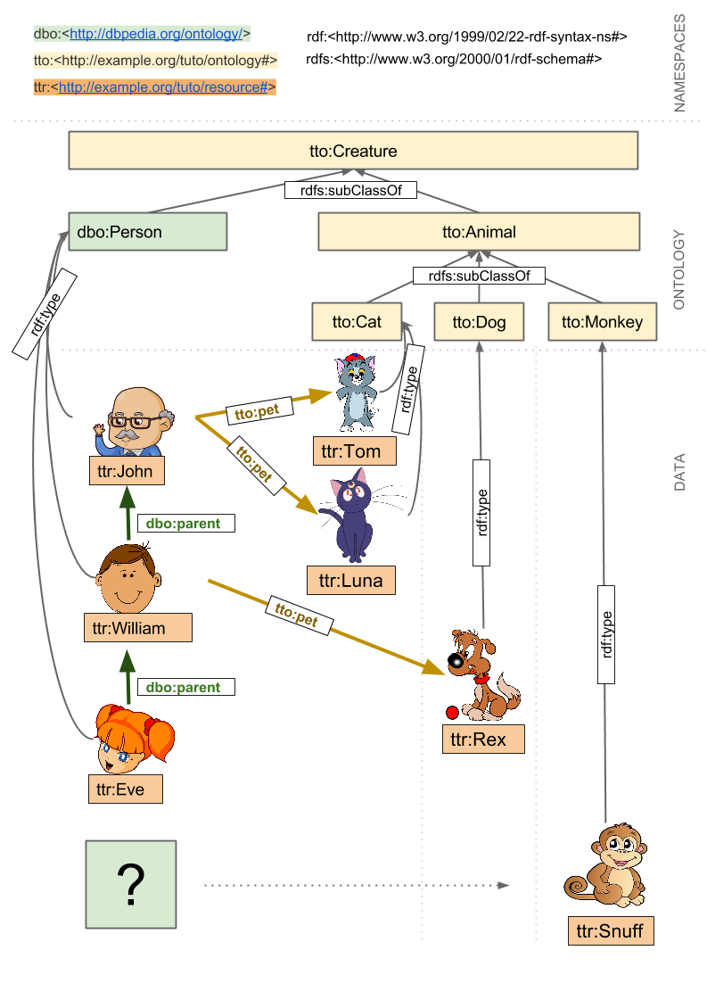
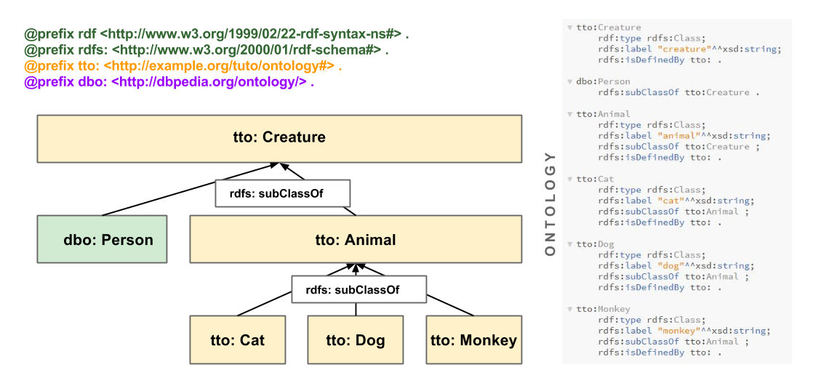
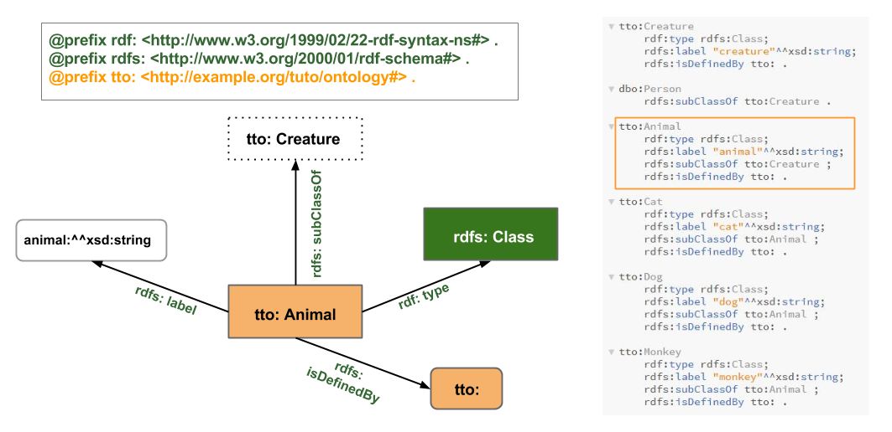
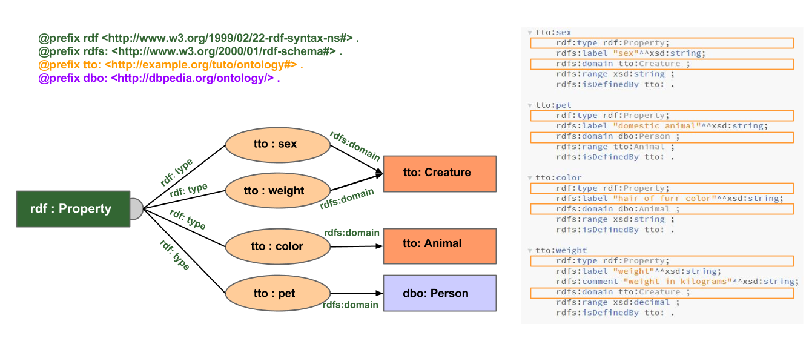

# SPARQL basics

This is the classic introductory SPARQL tutorial from [SPARQL playground](https://github.com/calipho-sib/sparql-playground), SIB's original standalone training tool, brought over here so it runs the same way as the rest of this site: every query below runs directly in your browser, against one small example dataset you can see (and edit) right in the page.

## Scenario

This example contains a very simple dataset about persons and their pets.

The diagram below shows the main resources it contains (a simplified view &mdash; every triple can be seen in the example data box further down, and in the diagrams below).

<a href="assets/model.png" target="_blank"></a>

## Ontology

A quick look at how the classes and properties in this example are modeled &mdash; useful background before diving into the queries, and a reasonable pattern to follow in your own data.

### Classes

A class should be defined with `rdf:type rdfs:Class` (or `owl:Class`).

<a href="assets/ontology-classes.png" target="_blank"></a>

Here is the `tto:Animal` class in detail:

<a href="assets/ontology-class-details.png" target="_blank"></a>

### Properties

Properties are attached to their domain with `rdfs:domain` &mdash; it's also good practice to attach them to their `rdfs:range`.

<a href="assets/ontology-properties.png" target="_blank"></a>

## The example data

Every query on this page runs against the dataset below &mdash; the same ontology and data shown in the diagrams above, combined into one file. It's editable: change it, then re-run (or re-open the graph view for) any query further down the page. A couple of the exercises below will specifically ask you to do that.

```turtle fixture=family
@prefix xsd: <http://www.w3.org/2001/XMLSchema#> .
@prefix rdf: <http://www.w3.org/1999/02/22-rdf-syntax-ns#> .
@prefix rdfs: <http://www.w3.org/2000/01/rdf-schema#> .
@prefix dbpedia: <http://dbpedia.org/resource/> .
@prefix dbo: <http://dbpedia.org/ontology/> .
@prefix dbp: <http://dbpedia.org/property/> .
@prefix tto: <http://example.org/tuto/ontology#> .
@prefix ttr: <http://example.org/tuto/resource#> .

# - - - - - - - - - - - - - - - - - - - - - - - - - - -
# Classes
# - - - - - - - - - - - - - - - - - - - - - - - - - - -

tto:Creature
	rdf:type rdfs:Class;
	rdfs:label "creature"^^xsd:string;
	rdfs:isDefinedBy tto: .

dbo:Person
	rdfs:subClassOf tto:Creature .

tto:Animal
	rdf:type rdfs:Class;
	rdfs:label "animal"^^xsd:string;
	rdfs:subClassOf tto:Creature ;
	rdfs:isDefinedBy tto: .

tto:Cat
	rdf:type rdfs:Class;
	rdfs:label "cat"^^xsd:string;
	rdfs:subClassOf tto:Animal ;
	rdfs:isDefinedBy tto: .

tto:Dog
	rdf:type rdfs:Class;
	rdfs:label "dog"^^xsd:string;
	rdfs:subClassOf tto:Animal ;
	rdfs:isDefinedBy tto: .

tto:Monkey
	rdf:type rdfs:Class;
	rdfs:label "monkey"^^xsd:string;
	rdfs:subClassOf tto:Animal ;
	rdfs:isDefinedBy tto: .

# - - - - - - - - - - - - - - - - - - - - - - - - - - -
# Properties
# - - - - - - - - - - - - - - - - - - - - - - - - - - -

tto:sex
	rdf:type rdf:Property;
	rdfs:label "sex"^^xsd:string;
	rdfs:domain tto:Creature ;
	rdfs:range xsd:string ;
	rdfs:isDefinedBy tto: .

tto:pet
	rdf:type rdf:Property;
	rdfs:label "domestic animal"^^xsd:string;
	rdfs:domain dbo:Person ;
	rdfs:range tto:Animal ;
	rdfs:isDefinedBy tto: .

tto:weight
	rdf:type rdf:Property;
	rdfs:label "weight"^^xsd:string;
	rdfs:comment "weight in kilograms"^^xsd:string;
	rdfs:domain tto:Creature ;
	rdfs:range xsd:decimal ;
	rdfs:isDefinedBy tto: .

tto:color
	rdf:type rdf:Property;
	rdfs:label "color"^^xsd:string;
	rdfs:domain dbo:Animal ;
	rdfs:range xsd:string ;
	rdfs:isDefinedBy tto: .

# - - - - - - - - - - - - - - - - - - - - - - - - - - -
# Data
# - - - - - - - - - - - - - - - - - - - - - - - - - - -

ttr:John
	rdf:type dbo:Person ;
	dbp:name "John" ;
	dbp:birthDate "1942-02-02"^^xsd:date ;
	tto:sex "male" ;
	tto:pet ttr:TomCat, ttr:LunaCat .

ttr:William
	rdf:type dbo:Person ;
	dbp:name "William";
	dbp:birthDate "1978-07-20"^^xsd:date ;
	tto:sex "male" ;
	dbo:parent ttr:John ;
	tto:pet ttr:RexDog .

ttr:Eve
	rdf:type dbo:Person ;
	dbp:name "Eve";
	dbp:birthDate "2006-11-03"^^xsd:date ;
	dbo:parent ttr:William ;
	tto:sex "female" .

ttr:TomCat
	rdf:type tto:Cat ;
	dbp:name "Tom";
	tto:sex "male";
	tto:color "grey";
	tto:weight 5.8 .

ttr:LunaCat
	rdf:type tto:Cat ;
	dbp:name "Luna" ;
	tto:sex "female" ;
	tto:color "violet";
	tto:weight 4.2 .

ttr:RexDog
	rdf:type tto:Dog ;
	dbp:name "Rex";
	tto:sex "male";
	tto:color "brown" ;
	tto:weight 8.8 .

ttr:SnuffMonkey
	rdf:type tto:Monkey ;
	dbp:name "Snuff"^^xsd:string ;
	tto:color "golden"^^xsd:string ;
	tto:sex "male" ;
	tto:weight "3.6"^^xsd:decimal .
```

Click **&#9679; Visualize as graph** above to see this dataset drawn out as a graph &mdash; every other example dataset on this site has the same option.

## Basic patterns

### Select things that are persons

Selects subjects connected to the object `dbo:Person` via the predicate `rdf:type`. `?thing` is the only variable.

```sparql fixture=family
PREFIX xsd: <http://www.w3.org/2001/XMLSchema#>
PREFIX rdf: <http://www.w3.org/1999/02/22-rdf-syntax-ns#>
PREFIX rdfs: <http://www.w3.org/2000/01/rdf-schema#>
PREFIX dbpedia: <http://dbpedia.org/resource/>
PREFIX dbo: <http://dbpedia.org/ontology/>
PREFIX dbp: <http://dbpedia.org/property/>
PREFIX tto: <http://example.org/tuto/ontology#>
PREFIX ttr: <http://example.org/tuto/resource#>

select ?thing where {
  ?thing rdf:type dbo:Person .
}

# Remember that in the example data above we can see:
#
# 'ttr:John a dbo:Person'
#
# 'a' can also be used instead of 'rdf:type'
# 'a' is a synonym of 'rdf:type'

# The name of the variable can have any value
```

### Select things that are females

Selects subjects connected to the literal `"female"` via the predicate `tto:sex`. `?thing` is the only variable.

```sparql fixture=family
PREFIX xsd: <http://www.w3.org/2001/XMLSchema#>
PREFIX rdf: <http://www.w3.org/1999/02/22-rdf-syntax-ns#>
PREFIX rdfs: <http://www.w3.org/2000/01/rdf-schema#>
PREFIX dbpedia: <http://dbpedia.org/resource/>
PREFIX dbo: <http://dbpedia.org/ontology/>
PREFIX dbp: <http://dbpedia.org/property/>
PREFIX tto: <http://example.org/tuto/ontology#>
PREFIX ttr: <http://example.org/tuto/resource#>

select ?thing where {
  ?thing tto:sex "female" .
}

# Notice that not only the persons
# but also the pets are taken
```

### Select things that are persons and are female (women)

Selects subjects connected to the object `dbo:Person` via the predicate `rdf:type`, and use the same variable `?thing` to connect to the literal `"female"` via the predicate `tto:sex`.

```sparql fixture=family
PREFIX xsd: <http://www.w3.org/2001/XMLSchema#>
PREFIX rdf: <http://www.w3.org/1999/02/22-rdf-syntax-ns#>
PREFIX rdfs: <http://www.w3.org/2000/01/rdf-schema#>
PREFIX dbpedia: <http://dbpedia.org/resource/>
PREFIX dbo: <http://dbpedia.org/ontology/>
PREFIX dbp: <http://dbpedia.org/property/>
PREFIX tto: <http://example.org/tuto/ontology#>
PREFIX ttr: <http://example.org/tuto/resource#>

select ?thing where {
  ?thing a dbo:Person .
  ?thing tto:sex "female" .
}

# Use the same name of the variable in the 2 statements
# It is the name of the variable that enforces the constraint

# Note the dot "." which must be added after the first statement,
# otherwise you get a MalformedQueryException

# Hint: use the semicolon ';' to refer to the previous subject
#
# select ?thing where {
#  ?thing a dbo:Person ;
#   		tto:sex "female" .
# }

# Note that we could also use the comma ',', if we had hermaphrodites in our dataset
# The following statement selects things that are persons male and female at the same time:
# select ?thing where {
#  ?thing a dbo:Person ;
#   		tto:sex "female" , "male"
# }
# Of course this does not return any value in our "normal" dataset...
```

### Select things that have a sex

Selects subjects connected to any literal `?sex` via the predicate `tto:sex`. Two variables are used, `?sex` and `?thing` &mdash; we could also use `*` in the select clause instead of naming both variables.

```sparql fixture=family
PREFIX xsd: <http://www.w3.org/2001/XMLSchema#>
PREFIX rdf: <http://www.w3.org/1999/02/22-rdf-syntax-ns#>
PREFIX rdfs: <http://www.w3.org/2000/01/rdf-schema#>
PREFIX dbpedia: <http://dbpedia.org/resource/>
PREFIX dbo: <http://dbpedia.org/ontology/>
PREFIX dbp: <http://dbpedia.org/property/>
PREFIX tto: <http://example.org/tuto/ontology#>
PREFIX ttr: <http://example.org/tuto/resource#>

select ?thing ?sex where {
  ?thing tto:sex ?sex .
}

# Notice that we get 2 variables in our dataset
#
# Explore the use of the keywords LIMIT and OFFSET at the end of the query
#
# example: LIMIT 3
# example: OFFSET 2 LIMIT 3
#
# Replace the ?thing in the select by distinct, to get the number of distinct sexes in the dataset
```

### Select persons and their pets

From now on let's assume that "select persons" means "select things that are persons" by selecting subjects connected to the object `dbo:Person` via the predicate `rdf:type`. Here we also want the `?person` to be connected to an object `?pet` via the predicate `tto:pet`. `?person` and `?pet` are the 2 variables.

```sparql fixture=family
PREFIX xsd: <http://www.w3.org/2001/XMLSchema#>
PREFIX rdf: <http://www.w3.org/1999/02/22-rdf-syntax-ns#>
PREFIX rdfs: <http://www.w3.org/2000/01/rdf-schema#>
PREFIX dbpedia: <http://dbpedia.org/resource/>
PREFIX dbo: <http://dbpedia.org/ontology/>
PREFIX dbp: <http://dbpedia.org/property/>
PREFIX tto: <http://example.org/tuto/ontology#>
PREFIX ttr: <http://example.org/tuto/resource#>

select ?person ?pet where {
    ?person rdf:type dbo:Person .
	?person tto:pet ?pet .
}

# notice that only the persons
# who actually have a pet are returned in the result set
```

### Select persons and, if they have any, their pets as well

Similar to the previous one, but the triple with `tto:pet` is inside an `optional` clause.

```sparql fixture=family
PREFIX xsd: <http://www.w3.org/2001/XMLSchema#>
PREFIX rdf: <http://www.w3.org/1999/02/22-rdf-syntax-ns#>
PREFIX rdfs: <http://www.w3.org/2000/01/rdf-schema#>
PREFIX dbpedia: <http://dbpedia.org/resource/>
PREFIX dbo: <http://dbpedia.org/ontology/>
PREFIX dbp: <http://dbpedia.org/property/>
PREFIX tto: <http://example.org/tuto/ontology#>
PREFIX ttr: <http://example.org/tuto/resource#>

select ?person ?pet where {
    ?person rdf:type dbo:Person .
	optional {?person tto:pet ?pet }.
}

# The use of the clause optional allows
# to extract their pets if they exist
# but will not exclude the persons who don't have pets
```

### Select persons that DO NOT have any pets

Selects persons and asserts that the selected persons have no link to an object via the predicate `tto:pet`.

```sparql fixture=family
PREFIX xsd: <http://www.w3.org/2001/XMLSchema#>
PREFIX rdf: <http://www.w3.org/1999/02/22-rdf-syntax-ns#>
PREFIX rdfs: <http://www.w3.org/2000/01/rdf-schema#>
PREFIX dbpedia: <http://dbpedia.org/resource/>
PREFIX dbo: <http://dbpedia.org/ontology/>
PREFIX dbp: <http://dbpedia.org/property/>
PREFIX tto: <http://example.org/tuto/ontology#>
PREFIX ttr: <http://example.org/tuto/resource#>

select ?person ?pet where {
    ?person rdf:type dbo:Person .
	filter not exists {?person tto:pet ?pet }.
}

# Note that the variable ?pet is not bound even if you use filter exists instead:
# filter exists {?person tto:pet ?_ }.
```

### William's and John's pets

Selects the pets of a list of owners, using `union` or `values`.

```sparql fixture=family
PREFIX xsd: <http://www.w3.org/2001/XMLSchema#>
PREFIX rdf: <http://www.w3.org/1999/02/22-rdf-syntax-ns#>
PREFIX rdfs: <http://www.w3.org/2000/01/rdf-schema#>
PREFIX dbpedia: <http://dbpedia.org/resource/>
PREFIX dbo: <http://dbpedia.org/ontology/>
PREFIX dbp: <http://dbpedia.org/property/>
PREFIX tto: <http://example.org/tuto/ontology#>
PREFIX ttr: <http://example.org/tuto/resource#>

select ?pet where {
	{
		ttr:William tto:pet ?pet .
	} UNION {
		ttr:John tto:pet ?pet .
	}
}

# In this scenario we only have 2 persons who have pets, so it is not the best example,
# but you can see the potential of union in a real scenario with many owners, when you
# want to filter just a few of them
#
# Alternatively you can also use the keyword VALUES to set what ?owner could be (faster option)
#
# select ?owner ?pet where {
#	VALUES (?owner) { (ttr:William) (ttr:John) }
#	?owner tto:pet ?pet .
# }
```

## Exercises: relationships

These queries have blanks (`***`) &mdash; edit the query box below each one to fill them in, then click **Run query** to check your answer.

### Exercise: select Eve's grandfather

Use the property `dbo:parent` to connect Eve to her father...

```sparql fixture=family
PREFIX xsd: <http://www.w3.org/2001/XMLSchema#>
PREFIX rdf: <http://www.w3.org/1999/02/22-rdf-syntax-ns#>
PREFIX rdfs: <http://www.w3.org/2000/01/rdf-schema#>
PREFIX dbpedia: <http://dbpedia.org/resource/>
PREFIX dbo: <http://dbpedia.org/ontology/>
PREFIX dbp: <http://dbpedia.org/property/>
PREFIX tto: <http://example.org/tuto/ontology#>
PREFIX ttr: <http://example.org/tuto/resource#>

select ?grandfather where {
	ttr:Eve dbo:parent  *** .
	***	  	     ***   ?grandfather  .
}

# Alternative B) with /
#
# Once you get ttr:John,
# try to write the expression in only one line using '/'
# knowing that:
#
#             ?a prop ?c .
#			  ?c prop ?d .
#
# can be simplified like this:
#
#             ?a prop / prop ?d
```

### Exercise: select persons who don't have cats

You should filter out any person with a pet of type `tto:Cat`.

```sparql fixture=family
PREFIX xsd: <http://www.w3.org/2001/XMLSchema#>
PREFIX rdf: <http://www.w3.org/1999/02/22-rdf-syntax-ns#>
PREFIX rdfs: <http://www.w3.org/2000/01/rdf-schema#>
PREFIX dbpedia: <http://dbpedia.org/resource/>
PREFIX dbo: <http://dbpedia.org/ontology/>
PREFIX dbp: <http://dbpedia.org/property/>
PREFIX tto: <http://example.org/tuto/ontology#>
PREFIX ttr: <http://example.org/tuto/resource#>

select ?person where {
	?person rdf:type dbo:Person .
	*** *** *** {
		?person tto:pet / rdf:type *** .
	}
}
```

### Bonus exercise: select William's relatives

Join the results of "William's parent" and "people who have William as parent".

```sparql fixture=family
PREFIX xsd: <http://www.w3.org/2001/XMLSchema#>
PREFIX rdf: <http://www.w3.org/1999/02/22-rdf-syntax-ns#>
PREFIX rdfs: <http://www.w3.org/2000/01/rdf-schema#>
PREFIX dbpedia: <http://dbpedia.org/resource/>
PREFIX dbo: <http://dbpedia.org/ontology/>
PREFIX dbp: <http://dbpedia.org/property/>
PREFIX tto: <http://example.org/tuto/ontology#>
PREFIX ttr: <http://example.org/tuto/resource#>

select ?relative where {
  {ttr:William *** ?relative}
  ***
  {?relative *** ttr:William}
}

# B)
#
# Once you get ttr:Eve and ttr:John try to explore the use of inverse path ^
#
# knowing that:
#
# 			?a :prop ?b
#
# is equivalent to:
#
# 			?b ^:prop ?a

# C)
#
# Once B) is done, try to write the query in one line using the pipe (|) which means OR
#
#  ttr:William (prop | ^prop) ?relative
```

## Classes and the ontology

The same rules that apply to the data / resources also apply to the ontology / classes.

### Get the direct subclasses of class Creature

The single graph pattern matches all subjects described as `rdfs:subClassOf tto:Creature`.

```sparql fixture=family
PREFIX xsd: <http://www.w3.org/2001/XMLSchema#>
PREFIX rdf: <http://www.w3.org/1999/02/22-rdf-syntax-ns#>
PREFIX rdfs: <http://www.w3.org/2000/01/rdf-schema#>
PREFIX dbpedia: <http://dbpedia.org/resource/>
PREFIX dbo: <http://dbpedia.org/ontology/>
PREFIX dbp: <http://dbpedia.org/property/>
PREFIX tto: <http://example.org/tuto/ontology#>
PREFIX ttr: <http://example.org/tuto/resource#>

select ?subSpecies where {
  ?subSpecies rdfs:subClassOf tto:Creature .
}
```

### Get the direct and indirect subclasses of class Creature

The `+` after `rdfs:subClassOf` retrieves solutions for `?subSpecies` if it's connected to `tto:Creature` by one or more `rdfs:subClassOf` predicates.

```sparql fixture=family
PREFIX xsd: <http://www.w3.org/2001/XMLSchema#>
PREFIX rdf: <http://www.w3.org/1999/02/22-rdf-syntax-ns#>
PREFIX rdfs: <http://www.w3.org/2000/01/rdf-schema#>
PREFIX dbpedia: <http://dbpedia.org/resource/>
PREFIX dbo: <http://dbpedia.org/ontology/>
PREFIX dbp: <http://dbpedia.org/property/>
PREFIX tto: <http://example.org/tuto/ontology#>
PREFIX ttr: <http://example.org/tuto/resource#>

select ?subSpecies where {
  ?subSpecies rdfs:subClassOf+ tto:Creature .
}

# There are different ways to express the property path level:
#
# path+ | path* | path?
#
#  + -> means 1 or more
#  * -> means 0 or more
#  ? -> means 0 or 1

# The same can be used for any property, for example:
# select ?parents where {
#	ttr:Eve dbo:parent+ ?parents .
# }
```

### Select all things that are animals

Hint: use the property `rdfs:subClassOf+`, `rdf:type` and the class `tto:Animal`.

```sparql fixture=family
PREFIX xsd: <http://www.w3.org/2001/XMLSchema#>
PREFIX rdf: <http://www.w3.org/1999/02/22-rdf-syntax-ns#>
PREFIX rdfs: <http://www.w3.org/2000/01/rdf-schema#>
PREFIX dbpedia: <http://dbpedia.org/resource/>
PREFIX dbo: <http://dbpedia.org/ontology/>
PREFIX dbp: <http://dbpedia.org/property/>
PREFIX tto: <http://example.org/tuto/ontology#>
PREFIX ttr: <http://example.org/tuto/resource#>

select ?thing ?type where {
  ?type rdfs:subClassOf+ tto:Animal .
  ?thing a ?type .
}

# or simply
#
# select ?thing ?type where {
#  ?thing a / rdfs:subClassOf+ tto:Animal .
# }
```

## Exercise: find lonely pets a nice owner

This query shows pets with their owners, if they have any.

```sparql fixture=family
PREFIX xsd: <http://www.w3.org/2001/XMLSchema#>
PREFIX rdf: <http://www.w3.org/1999/02/22-rdf-syntax-ns#>
PREFIX rdfs: <http://www.w3.org/2000/01/rdf-schema#>
PREFIX dbpedia: <http://dbpedia.org/resource/>
PREFIX dbo: <http://dbpedia.org/ontology/>
PREFIX dbp: <http://dbpedia.org/property/>
PREFIX tto: <http://example.org/tuto/ontology#>
PREFIX ttr: <http://example.org/tuto/resource#>

select ?pet ?owner where {
  ?pet a / rdfs:subClassOf+ tto:Animal .
  optional {?owner tto:pet ?pet}
}
```

Now try this: edit the **example data** box further up this page and add this triple to it (right at the end, before the closing of the last entry, is fine):

```
dbpedia:Harrison_Ford tto:pet ttr:SnuffMonkey .
```

Then run the query above again &mdash; `ttr:SnuffMonkey` should now show up with an owner. Click **Reset data** on the data box to undo the change.

## Federated queries with DBpedia

The queries below combine this tiny local dataset with the real [DBpedia](https://dbpedia.org) SPARQL endpoint using the `SERVICE` keyword, so they can't run against the in-page example data alone (there's nothing to federate with). Paste them into a SPARQL client of your choice to run them against `https://dbpedia.org/sparql`.

```sparql reference="Federates the local dataset with https://dbpedia.org/sparql"
#title:Get Harrison Ford's pets and birth date
#comment:The birthday variable is retrieved from dbpedia using a federated query
#comment:through the SERVICE keyword. The graph retrieved is combined with the local graph
#comment:and solutions are built from the distant and local graph pattern matching processes.

SELECT * where {
   VALUES ?subj {dbpedia:Harrison_Ford}
   ?subj tto:pet ?pet .
   SERVICE <http://dbpedia.org/sparql> {
       ?subj dbp:birthDate ?birthday .
	 }
}
```

```sparql reference="Federates the local dataset with https://dbpedia.org/sparql"
#title:Celebrities born on the 13-07-1942 with their birth date, occupation and their pets if any
#comment:People born on the 13-07-1942 are retrieved from dbpedia using a federated query
#comment:through the SERVICE keyword. The local graph pattern here is optional so that we
#comment:can see celebrities for which we don't know about their pets.

select *  where {
    SERVICE <http://dbpedia.org/sparql> {
      select ?person ?birthDate ?occupation where {
        VALUES ?birthDate { "1942-07-13"^^xsd:date }
        ?person dbp:birthDate ?birthDate .
        ?person dbp:occupation ?occupation .
      }
    }
    OPTIONAL { ?person tto:pet ?pet } .
}
```

```sparql reference="Runs entirely against https://dbpedia.org/sparql"
#title:Harrison Ford's spouses and their age difference

SELECT * where {
   SERVICE <http://dbpedia.org/sparql> {
	   VALUES ?subj {dbpedia:Harrison_Ford}
	   ?subj dbp:spouse ?spouse .
       ?spouse a dbo:Person .
       ?subj dbp:birthDate ?harrisonFordBirthday .
	   ?spouse dbp:birthDate ?spouseBirthday .
	 }
	 # Computes the age difference
	 #BIND (year(?spouseBirthday) - ( year(?harrisonFordBirthday)) AS ?ageDiff )
}
```

## Intermediate / advanced features

### Select creature names starting with either R or I and ending with an x

Uses a regex pattern to find names meeting a complex criterion.

```sparql fixture=family
PREFIX xsd: <http://www.w3.org/2001/XMLSchema#>
PREFIX rdf: <http://www.w3.org/1999/02/22-rdf-syntax-ns#>
PREFIX rdfs: <http://www.w3.org/2000/01/rdf-schema#>
PREFIX dbpedia: <http://dbpedia.org/resource/>
PREFIX dbo: <http://dbpedia.org/ontology/>
PREFIX dbp: <http://dbpedia.org/property/>
PREFIX tto: <http://example.org/tuto/ontology#>
PREFIX ttr: <http://example.org/tuto/resource#>

select * where {
  ?creature dbp:name ?name .
  FILTER ( REGEX(?name, "^[RI].*x$" ) )
}
```

### Select things that have a weight between 5 and 7 kg, ordered by weight

Selects subjects described with the `tto:weight` predicate; the filter removes solutions outside the `?weight` range.

```sparql fixture=family
PREFIX xsd: <http://www.w3.org/2001/XMLSchema#>
PREFIX rdf: <http://www.w3.org/1999/02/22-rdf-syntax-ns#>
PREFIX rdfs: <http://www.w3.org/2000/01/rdf-schema#>
PREFIX dbpedia: <http://dbpedia.org/resource/>
PREFIX dbo: <http://dbpedia.org/ontology/>
PREFIX dbp: <http://dbpedia.org/property/>
PREFIX tto: <http://example.org/tuto/ontology#>
PREFIX ttr: <http://example.org/tuto/resource#>

select ?thing ?weight where {
  ?thing tto:weight ?weight .
  FILTER (?weight > 5 && ?weight < 7.0)
} order by ?weight

# by default the direction of ORDER BY is ascending (asc), use desc() for descending
# try to use desc(?weight)

# try to filter on strings:
# select ?thing ?weight where {
#  ?thing tto:color ?color .
#	FILTER (?color = "grey" || ?color = "white" )
# }
```

### Select persons with their birth date and calculated age

The age is computed with the functions `YEAR()` and `NOW()`. The resulting value is assigned to a new variable `?age` with `BIND`.

```sparql fixture=family
PREFIX xsd: <http://www.w3.org/2001/XMLSchema#>
PREFIX rdf: <http://www.w3.org/1999/02/22-rdf-syntax-ns#>
PREFIX rdfs: <http://www.w3.org/2000/01/rdf-schema#>
PREFIX dbpedia: <http://dbpedia.org/resource/>
PREFIX dbo: <http://dbpedia.org/ontology/>
PREFIX dbp: <http://dbpedia.org/property/>
PREFIX tto: <http://example.org/tuto/ontology#>
PREFIX ttr: <http://example.org/tuto/resource#>

select * where {
  ?person rdf:type dbo:Person .
  ?person dbp:birthDate ?birth .
  BIND ( ( year(now()) - year(?birth) ) AS ?age )
}
order by desc(?age)
```

### Get the number of persons by sex

The graph pattern matching process generates a list of `?sex`/`?people` pairs; then for each `?sex` value (the grouping criterion), the number of `?people` values is counted with the aggregate function `COUNT`.

```sparql fixture=family
PREFIX xsd: <http://www.w3.org/2001/XMLSchema#>
PREFIX rdf: <http://www.w3.org/1999/02/22-rdf-syntax-ns#>
PREFIX rdfs: <http://www.w3.org/2000/01/rdf-schema#>
PREFIX dbpedia: <http://dbpedia.org/resource/>
PREFIX dbo: <http://dbpedia.org/ontology/>
PREFIX dbp: <http://dbpedia.org/property/>
PREFIX tto: <http://example.org/tuto/ontology#>
PREFIX ttr: <http://example.org/tuto/resource#>

select ?sex (COUNT(?people) as ?peopleCount) where {
  ?people rdf:type dbo:Person .
  ?people tto:sex ?sex .
}
GROUP BY ?sex
```

## More exercises

### Get the count of pets by owner

Use the `tto:pet` predicate to link owners to pets. In the `SELECT`, use the aggregate function `COUNT()` for pets, and add a `GROUP BY` clause using the owner as the grouping criterion. Once you've added the Harrison Ford triple from the exercise above, this should return 3 rows with 2 columns, like: `ttr:John "1"`, `ttr:William "2"`, `dbpedia:Harrison_Ford "1"`.

```sparql fixture=family
PREFIX xsd: <http://www.w3.org/2001/XMLSchema#>
PREFIX rdf: <http://www.w3.org/1999/02/22-rdf-syntax-ns#>
PREFIX rdfs: <http://www.w3.org/2000/01/rdf-schema#>
PREFIX dbpedia: <http://dbpedia.org/resource/>
PREFIX dbo: <http://dbpedia.org/ontology/>
PREFIX dbp: <http://dbpedia.org/property/>
PREFIX tto: <http://example.org/tuto/ontology#>
PREFIX ttr: <http://example.org/tuto/resource#>

SELECT ?owner (count(?pet) as ?cnt) {
  ?owner tto:pet ?pet .
} GROUP BY ?owner
```

### Select things that are dogs with their color and sex

Create a graph pattern using `rdf:type` to connect any subject (`?thing`) to the object `tto:Dog`. Add two more graph patterns to get the subject's color and sex.

*(As given in the original tutorial, the query below actually matches `tto:Cat` rather than `tto:Dog` &mdash; kept as-is; try changing it to `tto:Dog` yourself.)*

```sparql fixture=family
PREFIX xsd: <http://www.w3.org/2001/XMLSchema#>
PREFIX rdf: <http://www.w3.org/1999/02/22-rdf-syntax-ns#>
PREFIX rdfs: <http://www.w3.org/2000/01/rdf-schema#>
PREFIX dbpedia: <http://dbpedia.org/resource/>
PREFIX dbo: <http://dbpedia.org/ontology/>
PREFIX dbp: <http://dbpedia.org/property/>
PREFIX tto: <http://example.org/tuto/ontology#>
PREFIX ttr: <http://example.org/tuto/resource#>

SELECT * {
	?thing a tto:Cat .
    ?thing tto:color ?color .
    ?thing tto:sex ?sex
}
```

### For each pet species, get the number of pets and their average weight

The graph pattern matching process generates a list of `?species`/`?pet`/`?weight` tuples; then for each `?species` value (the grouping criterion), the `?pet` values are counted and the average `?weight` is calculated with the aggregate functions `COUNT()` and `AVG()`.

```sparql fixture=family
PREFIX xsd: <http://www.w3.org/2001/XMLSchema#>
PREFIX rdf: <http://www.w3.org/1999/02/22-rdf-syntax-ns#>
PREFIX rdfs: <http://www.w3.org/2000/01/rdf-schema#>
PREFIX dbpedia: <http://dbpedia.org/resource/>
PREFIX dbo: <http://dbpedia.org/ontology/>
PREFIX dbp: <http://dbpedia.org/property/>
PREFIX tto: <http://example.org/tuto/ontology#>
PREFIX ttr: <http://example.org/tuto/resource#>

select ?species (COUNT(?pet) as ?petCount) (AVG(?weight) as ?avgWeight) where {
  ?species rdfs:subClassOf tto:Animal .
  ?pet rdf:type ?species .
  ?pet tto:weight ?weight .
}
GROUP BY ?species
```

### Get people's names and the year they were born

Use the `YEAR()` function to get the year they were born from their birth date, and use `BIND` to assign the result to a new variable.

```sparql fixture=family
PREFIX xsd: <http://www.w3.org/2001/XMLSchema#>
PREFIX rdf: <http://www.w3.org/1999/02/22-rdf-syntax-ns#>
PREFIX rdfs: <http://www.w3.org/2000/01/rdf-schema#>
PREFIX dbpedia: <http://dbpedia.org/resource/>
PREFIX dbo: <http://dbpedia.org/ontology/>
PREFIX dbp: <http://dbpedia.org/property/>
PREFIX tto: <http://example.org/tuto/ontology#>
PREFIX ttr: <http://example.org/tuto/resource#>

select ?name ?yearBorn where {
  ?person rdf:type dbo:Person .
  ?person dbp:birthDate ?birth .
  ?person dbp:name ?name .
  bind (year(?birth) as ?yearBorn)
}
```

### Get creature names, their length, their first 2 characters and their last 2 characters

Uses the `strlen()` and `substr()` string functions to get the name length, prefix and postfix. The results are bound to `?nameLength`, `?namePrefix` and `?namePostfix` with `BIND`.

```sparql fixture=family
PREFIX xsd: <http://www.w3.org/2001/XMLSchema#>
PREFIX rdf: <http://www.w3.org/1999/02/22-rdf-syntax-ns#>
PREFIX rdfs: <http://www.w3.org/2000/01/rdf-schema#>
PREFIX dbpedia: <http://dbpedia.org/resource/>
PREFIX dbo: <http://dbpedia.org/ontology/>
PREFIX dbp: <http://dbpedia.org/property/>
PREFIX tto: <http://example.org/tuto/ontology#>
PREFIX ttr: <http://example.org/tuto/resource#>

select * where {
  ?thing dbp:name ?name .
  BIND ( ( strlen(?name))  as ?nameLength)
  BIND ( ( substr(?name, 1, 2))  as ?namePrefix)
  BIND ( ( substr(?name, ?nameLength-1, 2))  as ?namePostfix)
}
```

## Ordering and grouping

### Select people with their gender and birth date, ordered by gender and birth date (oldest first)

By default the direction of `ORDER BY` is ascending (`asc`); use `desc()` for descending.

```sparql fixture=family
PREFIX xsd: <http://www.w3.org/2001/XMLSchema#>
PREFIX rdf: <http://www.w3.org/1999/02/22-rdf-syntax-ns#>
PREFIX rdfs: <http://www.w3.org/2000/01/rdf-schema#>
PREFIX dbpedia: <http://dbpedia.org/resource/>
PREFIX dbo: <http://dbpedia.org/ontology/>
PREFIX dbp: <http://dbpedia.org/property/>
PREFIX tto: <http://example.org/tuto/ontology#>
PREFIX ttr: <http://example.org/tuto/resource#>

select ?people ?sex ?birth ?name where {
  ?people rdf:type dbo:Person .
  ?people dbp:name ?name .
  ?people tto:sex ?sex .
  ?people dbp:birthDate ?birth .
}
ORDER BY ?sex desc(?birth)
```

### Get the count of individuals by species, for species with more than one member

The graph pattern matching process generates a list of `?species`/`?member` tuples; then for each `?species` value, the `?member` values are counted with `COUNT()`, and the result is filtered with `HAVING` to keep only species with more than one member.

```sparql fixture=family
PREFIX xsd: <http://www.w3.org/2001/XMLSchema#>
PREFIX rdf: <http://www.w3.org/1999/02/22-rdf-syntax-ns#>
PREFIX rdfs: <http://www.w3.org/2000/01/rdf-schema#>
PREFIX dbpedia: <http://dbpedia.org/resource/>
PREFIX dbo: <http://dbpedia.org/ontology/>
PREFIX dbp: <http://dbpedia.org/property/>
PREFIX tto: <http://example.org/tuto/ontology#>
PREFIX ttr: <http://example.org/tuto/resource#>

select ?species (COUNT(?member) as ?memberCount) where {
  ?species rdfs:subClassOf tto:Animal .
  ?member rdf:type ?species .
}
GROUP BY ?species
HAVING (COUNT(?member) > 1)
```
